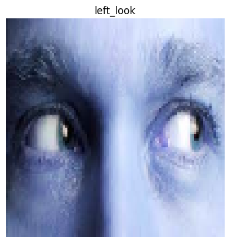

# Check Direction of eyes

Using haarcascades from open-cv, I map the eye directions(using a previous model) to distinguish to four major classes of eye directions

Classes:: ['CLOSE', 'FORWARD', 'LEFT', 'RIGHT']

Check haarcascades for python in:
https://github.com/opencv/opencv/tree/master/data/haarcascades

This repo uses haarcascades_eye.xml to patch eyes to make predictions recycling the model from:
https://github.com/intruder-404/Eye-Directional-Check

## Example

